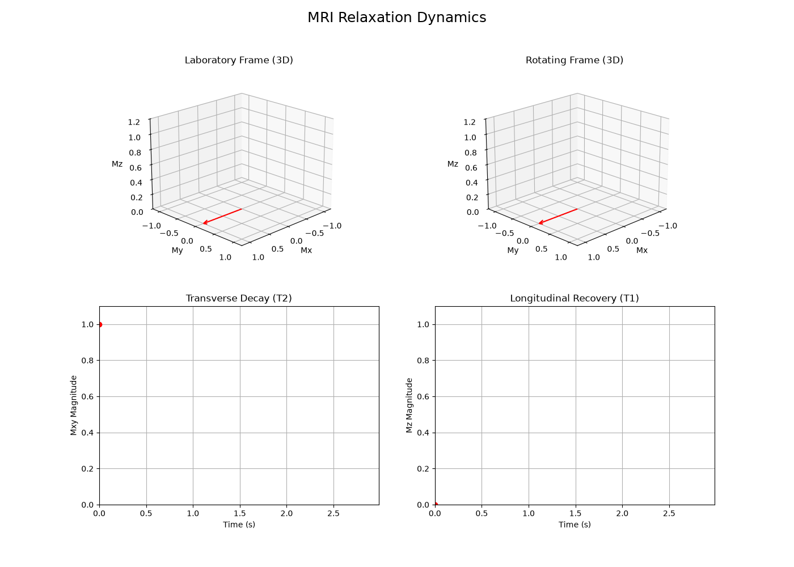

# MRI Physics Modeling

A Python-based educational simulation and visualization tool designed to bridge abstract MRI physics math with 3D reality. 

This project uses a dependency-light stack built entirely on pure NumPy for the mathematical Bloch equations engine and Matplotlib for the 3D rendering.

## Precession Visualization

**Proton Precession**  
Visualizes the fundamental behavior of a net magnetization vector precessing around the main magnetic field ($B_0$) at the Larmor frequency.

<video src="https://github.com/user-attachments/assets/b42e386f-b0d0-46d5-82ec-f0bf406763c7" autoplay loop muted playsinline></video>

**Larmor $B_0$ Comparison**  
Demonstrates the effect of varying magnetic field strengths on the rate of precession.

<video src="https://github.com/user-attachments/assets/0ccb522f-d956-4f64-a37d-74e53983cb18" autoplay loop muted playsinline></video>

## $2 \times 2$ Relaxation Dashboard

This simulation creates a synchronized, four-panel dashboard displaying the following simultaneous views:
1. **3D Laboratory Frame:** Shows full Larmor precession combined with T1/T2 relaxation.
2. **3D Rotating Frame:** Isolates pure relaxation by observing from a frame spinning at the Larmor frequency.
3. **2D Transverse Decay:** Tracks real-time T2 decay with synchronous markers.
4. **2D Longitudinal Recovery:** Tracks real-time T1 recovery with synchronous markers

