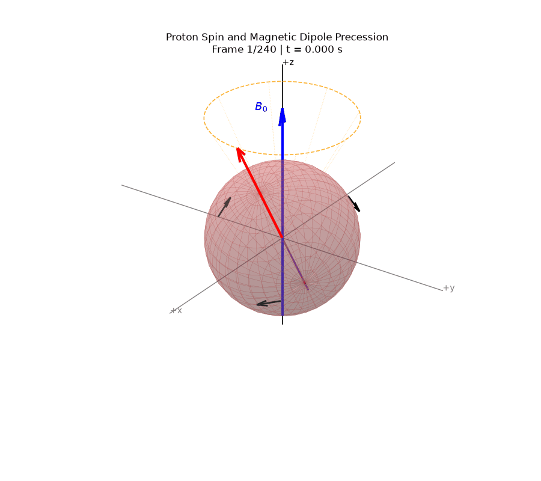
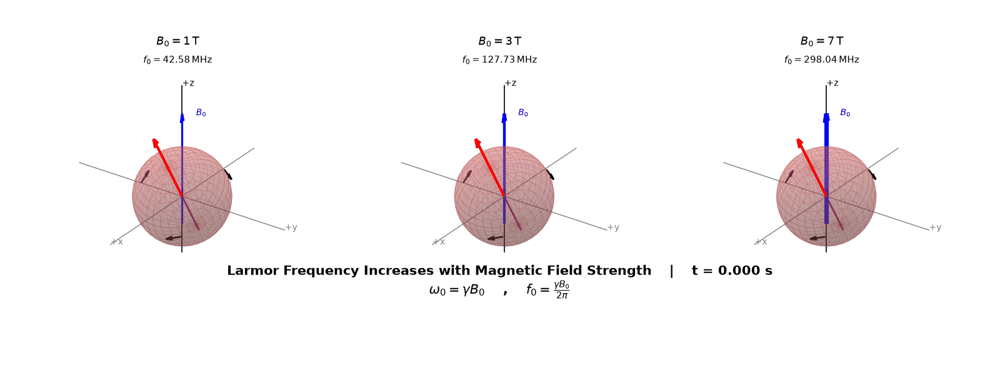
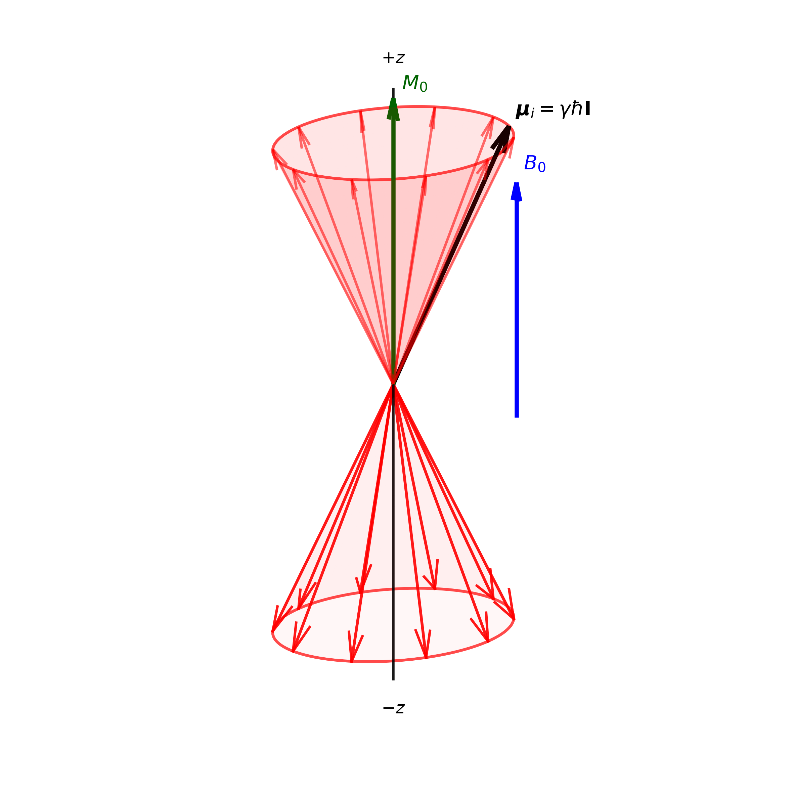

# MRI Physics Modeling

A Python-based educational simulation and visualization tool designed to bridge abstract MRI physics math with 3D reality. 

This project uses a dependency-light stack built entirely on pure NumPy for the mathematical Bloch equations engine and Matplotlib for the 3D rendering.

## Precession Visualization

**Proton Precession**  
Visualizes the fundamental behavior of a net magnetization vector precessing around the main magnetic field ($B_0$) at the Larmor frequency.

  

**Larmor $B_0$ Comparison**  
Demonstrates the effect of varying magnetic field strengths on the rate of precession.

## Macroscopic Magnetization

**Net Magnetization Vector ($M_0$)**  
Illustrates how individual precessing proton spins align parallel and anti-parallel to the main magnetic field to produce a net macroscopic magnetization vector.

  

## $2 \times 2$ Excitation & Relaxation Dashboard

This simulation creates a synchronized, four-panel dashboard displaying a 90° RF excitation pulse followed by free relaxation:
1. **3D Laboratory Frame:** Shows full Larmor precession during the RF tip-down and subsequent T1/T2 relaxation.
2. **3D Rotating Frame:** Isolates the right-hand rule torque of the $B_1$ field and pure relaxation by observing from a frame spinning at the Larmor frequency.
3. **2D Transverse Plane (Mxy):** Tracks the real-time Free Induction Decay (FID) signal generation and T2 decay.
4. **2D Longitudinal Axis (Mz):** Tracks real-time T1 recovery.

## References

The mathematical models and physics principles visualized in this repository are based on the following foundational texts:

* Xia, Y. (2022). *Essential Concepts in MRI: Physics, Instrumentation, Spectroscopy, and Imaging* (1st ed.). Wiley.
* Bushberg, J. T., et al. (2002). *The Essential Physics of Medical Imaging* (2nd ed.). Lippincott Williams and Wilkins.
* Hobbie, R. K., & Roth, B. J. (2007). *Intermediate Physics for Medicine and Biology* (4th ed.). Springer.
